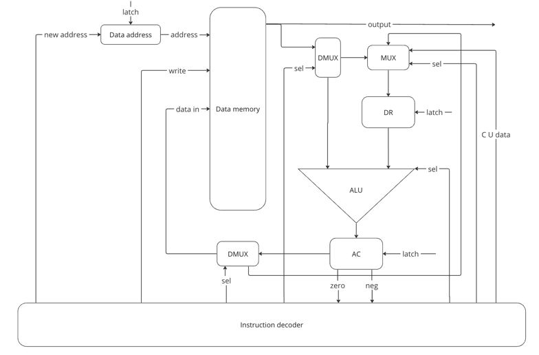
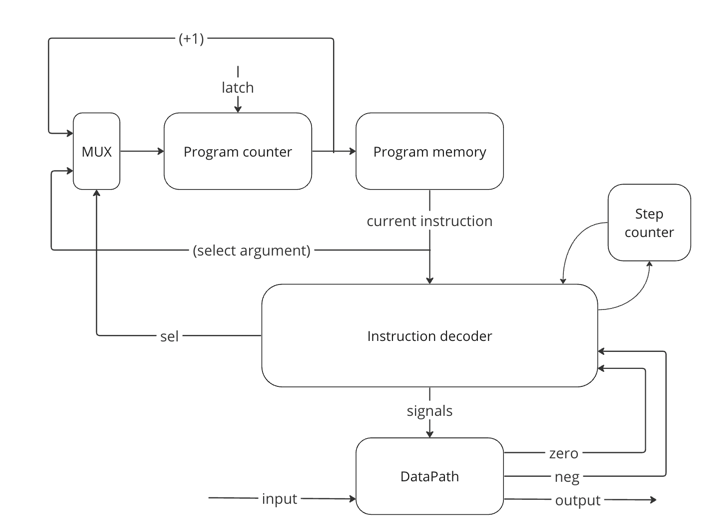

# Lisp. Транслятор и модель

- Иванов Андрей Вячеславович, P33101
- lisp | cisc | harv | hw | tick | struct | stream | mem | cstr | prob2 | [4]char
- Без усложнения.

## Язык программирования

``` ebnf
<Expressions>       := "(" <Expression> ")" | "(" <Expressions> ")"
<Expression>        := "(" <Operation> ")"

<Operation>         := <read-exp>
                    |  <print-exp> <Argument>
                    |  <def-exp> <Argument> <Argument>
                    |  <condition>
                    |  <if-exp> "(" <condition> ")" <Expressions>
                    |  <loop-exp> "(" <condition> ")" <Expressions>
                    |  <arithm-exp> <Argument> <Arguments>
					
<Arguments>         := <Argument> | <Argument> <Arguments>
             
<Argument>          := <Variable> | <number> | <sign> | <letter> | "(" <Argument> ")"

<read-exp>          := "read"
<print-exp>         := "print"
<def-exp>           := "defvar" | "setq" 
<cond-exp>          := "=" | "<" | "mod"
<loop-exp>          := "loop"
<if-exp>            := "if"
<arithm-exp>        := "+" | "-" | "*" | "/"

<condition>         := <cond-exp> <Argument> <Argument>
                       
<Variable>          := <letter> | <letter> <Variable>

<letter>            := "a" | "b" | ... | "z" | "A" | "B" | ... | "Z" | "_"
          
<number>            := "0" | "1" | "2" | ... | "9"

<sign>            := "?" | "!" | ","
                       
```

### Операции

- `+` Функция сложения, суммирует все параметры, возвращает результат
- `-` Функция вычитания, вычитает из первого параметра все остальные, возвращает результат
- `*` Функция умножения, умножает все параметры, возвращает результат
- `/` Функция деления, делит первый параметр на следующий и так далее, возвращает результат
- `mod` Данная функция принимает два аргумента, возвращает остаток от деления первого аргумента на второй
- `defvar` Функция объявления переменной, принимает на вход "имя переменной" "значение"
- `setq` Функция изменения значения существующей переменной, принимает на вход "имя переменной" "новое значение"
- `=` Функция принимает на вход два аргумента, если они не равны, то происходит переход на новый адрес. Поведение функции аналогично bne
- `<` Функция принимает на вход два аргумента, если первый меньше второго, то происходит переход на новый адрес. Поведение функции аналогично jl
- `if` Условный оператор.
- `loop` Функция объявления цикла
- `print` Функция записи в стандартный поток вывода
- `read` Функция чтения из стандартного входного потока

## Организация памяти

1. Память команд. Машинное слово - `32` бит. Реализуется списком словарей, описывающих инструкции (одно слово - одна
   команда).
2. Память данных. Машинное слово - `32` бит, знаковое. Линейное адресное пространство. Реализуется списком чисел.

## Cистема команд

Особенности процессора:

- Машинное слово – 32 бита, знаковое.
- Память данных:
    - адресуется через регистр `data_address`, значение может быть загружено только из `Control Unit`;
    - может быть записана:
        - из аккумулятора `AC`;
        - из ввода;
    - может быть прочитана в регистр данных `DR`
- Регистр аккумулятора: `AC`:
    - может быть записан в память;
    - используются флаги `zero`, `neg`;
- Регистр данных `DR`:
    - Используется для получения операндов из `Control Unit`, чтения данных из `Data memory`, сохранения результатов `AC`
- ALU
    - Производит арифметико-логические операции
    - На вход подаются данные из `DR` и Data memory
    - Поддерживаемые операции:
        - `add` - сложение двух операндов
        - `sub` - вычесть из значения на левом входе значение на правом входе
        - `mul` - умножение двух операндов
        - `div` - поделить значение на левом входе значение на правом входе
        - `mod` - остаток от деления значения левого входа от правого входа
        - `movv` - подать на выход значение левого входа (Для чтения данных)
    - Результат записывается в `AC`
- `program_counter` – счётчик команд:
    - Может быть перезаписан из `Control Unit`
    - Может быть инкрементирован
- Ввод/вывод осуществляется путем чтения и записи в определенные ячейки памяти

### Набор инструкций

| Syntax   | Mnemonic | Arguments      | Тактов | Comment                                                                                  |
|:---------|:---------|----------------|:------:|------------------------------------------------------------------------------------------|
| `defvar` | movv     | $addr1, $addr2 |   5    | Устанавливает значение $addr2 по данному адресу $addr1                                   |
|          | movv     | $addr1, value  |   4    | Устанавливает значение value по данному адресу $addr                                     |
| `setq`   | mov      | $addr          |   2    | Загружаем значения из AC по адресу $addr                                                 |
| `mod`    | mod      | $addr, value   |   2    | Сохраняет в AC остаток от деления значения по адресу $addr на value                      |
| `=`      | bne      | $addr          |   1    | Если AC != 0, то прыгаем на $addr                                                        |
| `<`      | jl       | $addr          |   1    | Если AC < 0, то прыгаем на $addr                                                         |
| `+`      | add      | $addr1, $addr2 |   4+   | Сложить значения, лежащие по адресам $addr1 $addr2, результат в AC                       |
| `-`      | sub      | $addr1, $addr2 |   4+   | Вычесть из значения, лежащего по адресу $addr1 значение в адресе $addr2, результат в AC  |
| `/`      | div      | $addr1, $addr2 |   4+   | Поделить значение, лежащее по адресу $addr1 на значение по адресу $addr2, результат в AC |
| `*`      | mul      | $addr1, $addr2 |   4+   | Умножить значения, лежащие по адресам $addr1 $addr2, результат в AC                      |
| `read`   | movv     | $addr1, $addr2 |   5    | Прочитать один символ с потока ввода                                                     |
| `print`  | movv     | $addr1, $addr2 |   5    | Вывод символа в поток вывода                                                             |
| `loop`   | jp       | $addr          |   1    | Безусловный переход по адресу $addr                                                      |
|          | halt     | 0              |   0    | остановка                                                                                | 

### Кодирование инструкций

- Машинный код сериализуется в список JSON.
- Одна команда функции – одна инструкция. (за исключением команды `<`, которая реализуется за 2 инструкции)
- Индекс списка – адрес инструкции. Используется для команд перехода.

Пример:

```json
    {
        "opcode": "add",
        "arg": [
            "$0",
            "$1"
        ]
    }
```

где:

- `opcode` – строка с кодом операции;
- `arg` – список аргументов;

## Транслятор

Интерфейс командной строки: `translator.py <input_file> <target_file>`

Реализовано в модуле: [translator](translator.py)

Этапы трансляции (функция `translate`):

1. Трансформирование текста в последовательность значимых термов.
2. Проверка корректности программы (парность скобок).
3. Генерация машинного кода.

Правила генерации машинного кода:

- Для учета циклов и других конструкций считается количество открытых и закрытых скобок
- После открывающийся скобки может идти как функция так и её аргументы
- Аргументами функций могут быть переменные, числа, другие функции
- Мы двигаемся по всем значимым термам и формируем машинный код, пока не пройдемся по всем

## Модель процессора

Интерфейс командной строки: `machine.py <machine_code_file> <input_file>`

Реализовано в модуле: [machine](./machine.py).

## Data Path


Реализован в классе `DataPath`.

- `data_memory` – однопортовая, поэтому либо читаем, либо пишем.

Сигналы (обрабатываются за один такт, реализованы в виде методов класса):

- `latch_data_addr` – защёлкнуть значение в `data_addr`;
- `latch_acc` – защёлкнуть в аккумулятор значение с ALU;
- `latch_dr` – защелкнуть в регистр данных выбранное значение
- `wr` – записать выбранное значение в память:
    - Из регистра `AC`

Флаги:
- `zero` – отражает наличие нулевого значения в аккумуляторе
- `neg` – отражает наличие отрицательного значения в аккумуляторе

## Control Unit


Реализован в классе `ControlUnit`.

- Hardwired (реализовано полностью на python).
- Моделирование с точностью до такта.
- Трансляция инструкции в последовательность сигналов: `decode_and_execute_instruction`.

Сигнал:

- `latch_program_counter` – сигнал для обновления счётчика команд в ControlUnit.

Особенности работы модели:

- Для журнала состояний процессора используется стандартный модуль logging.
- Количество инструкций для моделирования ограничено hardcoded константой.
- Остановка моделирования осуществляется при:
    - исключении `EOFError` – если нет данных для чтения из порта ввода-вывода;
    - исключении `StopIteration` – если выполнена инструкция `halt`.
- Управление симуляцией реализовано в функции `simulation`.

Как обрабатывать инструкции длиной в 2 машинных слова

Рассмотрим ситуацию, когда возникает инструкция длиной 2 машинных слова: 
`[add | [first_param(8-bit)] [second_param(8-bit)] [third_param(8-bit)] [forth_param(8-bit)] [fifth_param(8-bit)] 
[sixth_param(8-bit)]`

Первая инструкция: Control Unit декодирует данные о первых двух параметрах, записывает их сумму в `AC`, затем сохраняет 
информацию о типе оператора в `OP` (подготовка следующей инструкции), включает флаг `in_progress`, чтобы указать на 
завершение этой инструкции.

Вторая инструкция: Control Unit проверяет флаг `in_progress`, передает все инструкции в `DR`, выполняет операцию на ALU, 
выключает флаг `in_progress`.

## Тестирование

Тестирование выполняется при помощи golden test-ов.

Тесты для языка `lisp` реализованы в: [integration_test.py](integration_test.py).

Конфигурации:
- [cat.yml](golden%2Fcat.yml)
- [hello.yml](golden%2Fhello.yml)
- [hello_user_name.yml](golden%2Fhello_user_name.yml)
- [many_add.yml](golden%2Fmany_add.yml)
- [prob2.yml](golden%2Fprob2.yml)

Запустить тесты: `poetry run pytest . -v`

Обновить конфигурацию golden tests:  `poetry run pytest . -v --update-goldens`

CI при помощи Github Action:

``` yaml
defaults:
  run:
    working-directory: ./python

jobs:
  test:
    runs-on: ubuntu-latest

    steps:
      - name: Checkout code
        uses: actions/checkout@v4

      - name: Set up Python
        uses: actions/setup-python@v4
        with:
          python-version: 3.11

      - name: Install dependencies
        run: |
          python -m pip install --upgrade pip
          pip install poetry
          poetry install

      - name: Run tests and collect coverage
        run: |
          poetry run coverage run -m pytest .
          poetry run coverage report -m
        env:
          CI: true

  lint:
    runs-on: ubuntu-latest

    steps:
      - name: Checkout code
        uses: actions/checkout@v4

      - name: Set up Python
        uses: actions/setup-python@v4
        with:
          python-version: 3.11

      - name: Install dependencies
        run: |
          python -m pip install --upgrade pip
          pip install poetry
          poetry install

      - name: Check code formatting with Ruff
        run: poetry run ruff format --check .

      - name: Run Ruff linters
        run: poetry run ruff check .
```

где:

- `poetry` -- управления зависимостями для языка программирования Python.
- `coverage` -- формирование отчёта об уровне покрытия исходного кода.
- `pytest` -- утилита для запуска тестов.
- `ruff` -- утилита для форматирования и проверки стиля кодирования.


Пример использования и журнал работы процессора на примере `cat`:

``` shell
$ cat examples/foo.txt
foo
$ cat examples/cat.lisp 
(
    ( defvar r )
    ( defvar a 0 )
    ( defvar b 1 )
    (
        loop ( < a b )
        (
            ( setq r ( read ) )
            ( print r )
        )
    )
)
$ python3 translator.py examples/cat.lisp target.out
source LoC: 12 code instr: 9
$ cat target.out
[{"opcode": "movv", "arg": ["$0", " "]},
 {"opcode": "movv", "arg": ["$1", 0]},
 {"opcode": "movv", "arg": ["$2", 1]},
 {"opcode": "sub", "arg": ["$1", "$2"]},
 {"opcode": "jl", "arg": ["$8"]},
 {"opcode": "movv", "arg": ["$0", "$52"]},
 {"opcode": "movv", "arg": ["$69", "$0"]},
 {"opcode": "jp", "arg": ["$3"]},
 {"opcode": "halt"}]
$ python3 machine.py target.out examples/foo.txt                  
DEBUG:root:TICK: 0, PC: 0, ADDR: 0, MEM_OUT: 0, AC: 0, DR: 0 movv ['$0', ' ']
DEBUG:root:TICK: 1, PC: 0, ADDR: 0, MEM_OUT: 0, AC: 0, DR: 0 movv ['$0', ' ']
DEBUG:root:TICK: 2, PC: 0, ADDR: 0, MEM_OUT: 0, AC: 0, DR: 32 movv ['$0', ' ']
DEBUG:root:TICK: 3, PC: 0, ADDR: 0, MEM_OUT: 0, AC: 32, DR: 32 movv ['$0', ' ']
DEBUG:root:input: ' '
DEBUG:root:TICK: 4, PC: 1, ADDR: 0, MEM_OUT: 32, AC: 32, DR: 32 movv ['$1', 0]
DEBUG:root:TICK: 5, PC: 1, ADDR: 1, MEM_OUT: 0, AC: 32, DR: 32 movv ['$1', 0]
DEBUG:root:TICK: 6, PC: 1, ADDR: 1, MEM_OUT: 0, AC: 32, DR: 0 movv ['$1', 0]
DEBUG:root:TICK: 7, PC: 1, ADDR: 1, MEM_OUT: 0, AC: 0, DR: 0 movv ['$1', 0]
DEBUG:root:input: 0
DEBUG:root:TICK: 8, PC: 2, ADDR: 1, MEM_OUT: 0, AC: 0, DR: 0 movv ['$2', 1]
DEBUG:root:TICK: 9, PC: 2, ADDR: 2, MEM_OUT: 0, AC: 0, DR: 0 movv ['$2', 1]
DEBUG:root:TICK: 10, PC: 2, ADDR: 2, MEM_OUT: 0, AC: 0, DR: 1 movv ['$2', 1]
DEBUG:root:TICK: 11, PC: 2, ADDR: 2, MEM_OUT: 0, AC: 1, DR: 1 movv ['$2', 1]
DEBUG:root:input: 1
DEBUG:root:TICK: 12, PC: 3, ADDR: 2, MEM_OUT: 1, AC: 1, DR: 1 sub ['$1', '$2']
DEBUG:root:TICK: 13, PC: 3, ADDR: 1, MEM_OUT: 0, AC: 1, DR: 1 sub ['$1', '$2']
DEBUG:root:TICK: 14, PC: 3, ADDR: 1, MEM_OUT: 0, AC: 1, DR: 0 sub ['$1', '$2']
DEBUG:root:TICK: 15, PC: 3, ADDR: 2, MEM_OUT: 1, AC: 1, DR: 0 sub ['$1', '$2']
DEBUG:root:TICK: 16, PC: 4, ADDR: 2, MEM_OUT: 1, AC: 1, DR: 0 jl ['$8']
DEBUG:root:TICK: 17, PC: 5, ADDR: 2, MEM_OUT: 1, AC: 1, DR: 0 movv ['$0', '$52']
DEBUG:root:TICK: 18, PC: 5, ADDR: 52, MEM_OUT: 102, AC: 1, DR: 0 movv ['$0', '$52']
DEBUG:root:TICK: 19, PC: 5, ADDR: 52, MEM_OUT: 102, AC: 1, DR: 102 movv ['$0', '$52']
DEBUG:root:TICK: 20, PC: 5, ADDR: 0, MEM_OUT: 32, AC: 1, DR: 102 movv ['$0', '$52']
DEBUG:root:TICK: 21, PC: 5, ADDR: 0, MEM_OUT: 32, AC: 102, DR: 102 movv ['$0', '$52']
DEBUG:root:input: 'f'
DEBUG:root:TICK: 22, PC: 6, ADDR: 0, MEM_OUT: 102, AC: 102, DR: 102 movv ['$69', '$0']
DEBUG:root:TICK: 23, PC: 6, ADDR: 0, MEM_OUT: 102, AC: 102, DR: 102 movv ['$69', '$0']
DEBUG:root:TICK: 24, PC: 6, ADDR: 0, MEM_OUT: 102, AC: 102, DR: 102 movv ['$69', '$0']
DEBUG:root:TICK: 25, PC: 6, ADDR: 69, MEM_OUT: 0, AC: 102, DR: 102 movv ['$69', '$0']
DEBUG:root:TICK: 26, PC: 6, ADDR: 69, MEM_OUT: 0, AC: 102, DR: 102 movv ['$69', '$0']
DEBUG:root:output: '' << 'f'
DEBUG:root:TICK: 27, PC: 7, ADDR: 69, MEM_OUT: 102, AC: 102, DR: 102 jp ['$3']
DEBUG:root:TICK: 28, PC: 3, ADDR: 69, MEM_OUT: 102, AC: 102, DR: 102 sub ['$1', '$2']
DEBUG:root:TICK: 29, PC: 3, ADDR: 1, MEM_OUT: 0, AC: 102, DR: 102 sub ['$1', '$2']
DEBUG:root:TICK: 30, PC: 3, ADDR: 1, MEM_OUT: 0, AC: 102, DR: 0 sub ['$1', '$2']
DEBUG:root:TICK: 31, PC: 3, ADDR: 2, MEM_OUT: 1, AC: 102, DR: 0 sub ['$1', '$2']
DEBUG:root:TICK: 32, PC: 4, ADDR: 2, MEM_OUT: 1, AC: 1, DR: 0 jl ['$8']
DEBUG:root:TICK: 33, PC: 5, ADDR: 2, MEM_OUT: 1, AC: 1, DR: 0 movv ['$0', '$52']
DEBUG:root:TICK: 34, PC: 5, ADDR: 53, MEM_OUT: 111, AC: 1, DR: 0 movv ['$0', '$52']
DEBUG:root:TICK: 35, PC: 5, ADDR: 53, MEM_OUT: 111, AC: 1, DR: 111 movv ['$0', '$52']
DEBUG:root:TICK: 36, PC: 5, ADDR: 0, MEM_OUT: 102, AC: 1, DR: 111 movv ['$0', '$52']
DEBUG:root:TICK: 37, PC: 5, ADDR: 0, MEM_OUT: 102, AC: 111, DR: 111 movv ['$0', '$52']
DEBUG:root:input: 'o'
DEBUG:root:TICK: 38, PC: 6, ADDR: 0, MEM_OUT: 111, AC: 111, DR: 111 movv ['$69', '$0']
DEBUG:root:TICK: 39, PC: 6, ADDR: 0, MEM_OUT: 111, AC: 111, DR: 111 movv ['$69', '$0']
DEBUG:root:TICK: 40, PC: 6, ADDR: 0, MEM_OUT: 111, AC: 111, DR: 111 movv ['$69', '$0']
DEBUG:root:TICK: 41, PC: 6, ADDR: 70, MEM_OUT: 0, AC: 111, DR: 111 movv ['$69', '$0']
DEBUG:root:TICK: 42, PC: 6, ADDR: 70, MEM_OUT: 0, AC: 111, DR: 111 movv ['$69', '$0']
DEBUG:root:output: 'f' << 'o'
DEBUG:root:TICK: 43, PC: 7, ADDR: 70, MEM_OUT: 111, AC: 111, DR: 111 jp ['$3']
DEBUG:root:TICK: 44, PC: 3, ADDR: 70, MEM_OUT: 111, AC: 111, DR: 111 sub ['$1', '$2']
DEBUG:root:TICK: 45, PC: 3, ADDR: 1, MEM_OUT: 0, AC: 111, DR: 111 sub ['$1', '$2']
DEBUG:root:TICK: 46, PC: 3, ADDR: 1, MEM_OUT: 0, AC: 111, DR: 0 sub ['$1', '$2']
DEBUG:root:TICK: 47, PC: 3, ADDR: 2, MEM_OUT: 1, AC: 111, DR: 0 sub ['$1', '$2']
DEBUG:root:TICK: 48, PC: 4, ADDR: 2, MEM_OUT: 1, AC: 1, DR: 0 jl ['$8']
DEBUG:root:TICK: 49, PC: 5, ADDR: 2, MEM_OUT: 1, AC: 1, DR: 0 movv ['$0', '$52']
DEBUG:root:TICK: 50, PC: 5, ADDR: 54, MEM_OUT: 111, AC: 1, DR: 0 movv ['$0', '$52']
DEBUG:root:TICK: 51, PC: 5, ADDR: 54, MEM_OUT: 111, AC: 1, DR: 111 movv ['$0', '$52']
DEBUG:root:TICK: 52, PC: 5, ADDR: 0, MEM_OUT: 111, AC: 1, DR: 111 movv ['$0', '$52']
DEBUG:root:TICK: 53, PC: 5, ADDR: 0, MEM_OUT: 111, AC: 111, DR: 111 movv ['$0', '$52']
DEBUG:root:input: 'o'
DEBUG:root:TICK: 54, PC: 6, ADDR: 0, MEM_OUT: 111, AC: 111, DR: 111 movv ['$69', '$0']
DEBUG:root:TICK: 55, PC: 6, ADDR: 0, MEM_OUT: 111, AC: 111, DR: 111 movv ['$69', '$0']
DEBUG:root:TICK: 56, PC: 6, ADDR: 0, MEM_OUT: 111, AC: 111, DR: 111 movv ['$69', '$0']
DEBUG:root:TICK: 57, PC: 6, ADDR: 71, MEM_OUT: 0, AC: 111, DR: 111 movv ['$69', '$0']
DEBUG:root:TICK: 58, PC: 6, ADDR: 71, MEM_OUT: 0, AC: 111, DR: 111 movv ['$69', '$0']
DEBUG:root:output: 'fo' << 'o'
DEBUG:root:TICK: 59, PC: 7, ADDR: 71, MEM_OUT: 111, AC: 111, DR: 111 jp ['$3']
DEBUG:root:TICK: 60, PC: 3, ADDR: 71, MEM_OUT: 111, AC: 111, DR: 111 sub ['$1', '$2']
DEBUG:root:TICK: 61, PC: 3, ADDR: 1, MEM_OUT: 0, AC: 111, DR: 111 sub ['$1', '$2']
DEBUG:root:TICK: 62, PC: 3, ADDR: 1, MEM_OUT: 0, AC: 111, DR: 0 sub ['$1', '$2']
DEBUG:root:TICK: 63, PC: 3, ADDR: 2, MEM_OUT: 1, AC: 111, DR: 0 sub ['$1', '$2']
DEBUG:root:TICK: 64, PC: 4, ADDR: 2, MEM_OUT: 1, AC: 1, DR: 0 jl ['$8']
DEBUG:root:TICK: 65, PC: 5, ADDR: 2, MEM_OUT: 1, AC: 1, DR: 0 movv ['$0', '$52']
DEBUG:root:TICK: 66, PC: 5, ADDR: 55, MEM_OUT: 0, AC: 1, DR: 0 movv ['$0', '$52']
DEBUG:root:TICK: 67, PC: 5, ADDR: 55, MEM_OUT: 0, AC: 1, DR: 0 movv ['$0', '$52']
DEBUG:root:TICK: 68, PC: 5, ADDR: 0, MEM_OUT: 111, AC: 1, DR: 0 movv ['$0', '$52']
DEBUG:root:TICK: 69, PC: 5, ADDR: 0, MEM_OUT: 111, AC: 0, DR: 0 movv ['$0', '$52']
DEBUG:root:input: 0
DEBUG:root:TICK: 70, PC: 6, ADDR: 0, MEM_OUT: 0, AC: 0, DR: 0 movv ['$69', '$0']
DEBUG:root:TICK: 71, PC: 6, ADDR: 0, MEM_OUT: 0, AC: 0, DR: 0 movv ['$69', '$0']
DEBUG:root:TICK: 72, PC: 6, ADDR: 0, MEM_OUT: 0, AC: 0, DR: 0 movv ['$69', '$0']
DEBUG:root:TICK: 73, PC: 6, ADDR: 72, MEM_OUT: 0, AC: 0, DR: 0 movv ['$69', '$0']
DEBUG:root:TICK: 74, PC: 6, ADDR: 72, MEM_OUT: 0, AC: 0, DR: 0 movv ['$69', '$0']
INFO:root:input_buffer: < foo
WARNING:root:Input buffer is empty!
INFO:root:output_buffer: > 'foo'
foo
instr_counter: 21  ticks: 74
```

Пример проверки исходного кода:

``` shell
$ poetry run pytest . -v
========================================================================= test session starts =========================================================================
platform darwin -- Python 3.11.7, pytest-7.4.4, pluggy-1.4.0 -- /Users/anvisero/Library/Caches/pypoetry/virtualenvs/lab3-TZmuoKSD-py3.11/bin/python
cachedir: .pytest_cache
rootdir: /Users/anvisero/Desktop/ITMO/3course/1semester/Архитектура компьютера/lab3
configfile: pyproject.toml
plugins: golden-0.2.2
collected 5 items                                                                                                                                                     

integration_test.py::test_translator_and_machine[golden/cat.yml] PASSED                                                                                         [ 20%]
integration_test.py::test_translator_and_machine[golden/prob2.yml] PASSED                                                                                       [ 40%]
integration_test.py::test_translator_and_machine[golden/hello.yml] PASSED                                                                                       [ 60%]
integration_test.py::test_translator_and_machine[golden/many_add.yml] PASSED                                                                                    [ 80%]
integration_test.py::test_translator_and_machine[golden/hello_user_name.yml] PASSED                                                                             [100%]

========================================================================== 5 passed in 0.13s ==========================================================================
$  poetry run ruff check .
$  poetry run ruff format .
5 files left unchanged
```


| ФИО                        | алг             | LoC | code байт  | code инстр. | инстр. | такт. | вариант                                                                                   |
|----------------------------|-----------------|-----|------------|-------------|--------|-------|-------------------------------------------------------------------------------------------|
| Иванов Андрей Вячеславович | cat             | 12  | -          | 9           | 21     | 74    | lisp \| cisc \| harv \| hw \| tick \| struct \| stream \| mem \| cstr \| prob2 \| [4]char |
| Иванов Андрей Вячеславович | hello           | 22  | -          | 20          | 19     | 87    | lisp \| cisc \| harv \| hw \| tick \| struct \| stream \| mem \| cstr \| prob2 \| [4]char |
| Иванов Андрей Вячеславович | many_add        | 11  | -          | 11          | 10     | 49    | lisp \| cisc \| harv \| hw \| tick \| struct \| stream \| mem \| cstr \| prob2 \| [4]char |
| Иванов Андрей Вячеславович | hello_user_name | 64  | -          | 56          | 78     | 321   | lisp \| cisc \| harv \| hw \| tick \| struct \| stream \| mem \| cstr \| prob2 \| [4]char |
| Иванов Андрей Вячеславович | prob2           | 21  | -          | 18          | 318    | 896   | lisp \| cisc \| harv \| hw \| tick \| struct \| stream \| mem \| cstr \| prob2 \| [4]char |